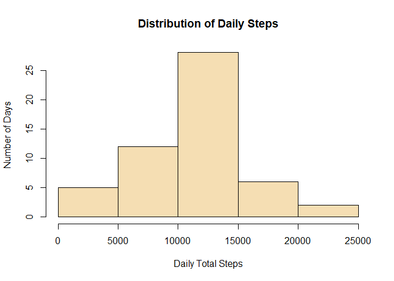
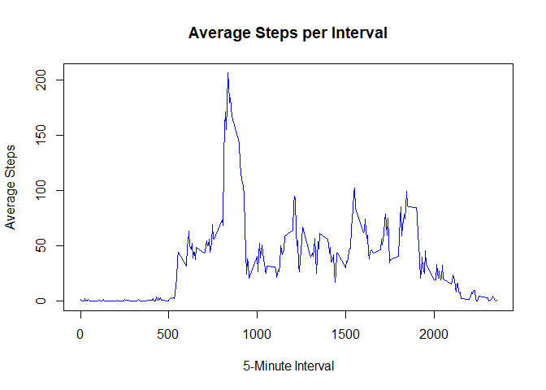
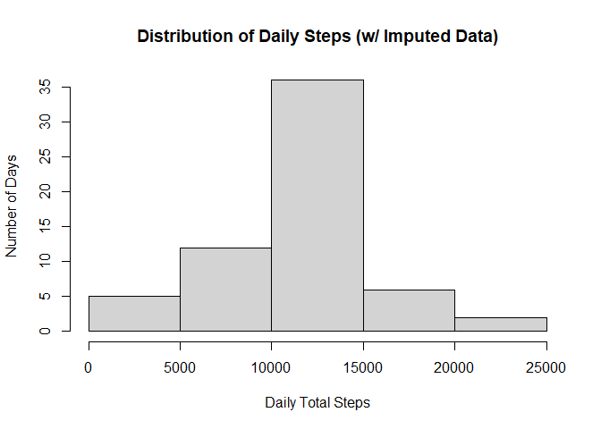

## Loading and preprocessing the data


```r
library(knitr)

# Project forked from original https://github.com/rdpeng/RepData_PeerAssessment1

# Load the data (i.e. read.csv()) -- check for data files

if (!file.exists("activity.csv")) {
	unzip("activity.zip")
}

stepdata <- read.csv("activity.csv", header = TRUE)

# Process/transform the data (if necessary) into a format suitable for your analysis

stepdata$date <- as.Date(stepdata$date, format = "%Y-%m-%d")

# list a sample of the data

tail(stepdata)
```

```
##       steps       date interval
## 17563    NA 2012-11-30     2330
## 17564    NA 2012-11-30     2335
## 17565    NA 2012-11-30     2340
## 17566    NA 2012-11-30     2345
## 17567    NA 2012-11-30     2350
## 17568    NA 2012-11-30     2355
```

## What is mean total number of steps taken per day?


```r
# Calculate the total number of steps taken per day

dailysteps <- aggregate(steps~date, stepdata, sum)

# Make a histogram of the total number of steps taken each day
# Using a simple histogram from base plotting system

hist(dailysteps$steps, xlab="Daily Total Steps", ylab="Number of Days", 
	 main="Distribution of Daily Steps")
```

<!-- -->

```r
# Calculate and report the mean and median of the total number of steps taken per day

meansteps <- mean(dailysteps$steps)
meansteps
```

```
## [1] 10766.19
```

```r
mediansteps <- median(dailysteps$steps)
mediansteps
```

```
## [1] 10765
```

#### The mean number of steps per day is 10766.19  
#### The median number of steps per day is 10765  

## What is the average daily activity pattern?


```r
# Make a time series plot (i.e. type = "l") of the 5-minute interval (x-axis) and the average number of steps taken, averaged across all days (y-axis)
# Using a simple plot from base plotting system

avgstepinterval <- aggregate(steps~interval, stepdata, mean)

plot(avgstepinterval$interval, avgstepinterval$steps, type = "l", xlab = "Interval", ylab = "Average Steps", 
	 main = "Average Steps per Interval")
```

<!-- -->

```r
# Which 5-minute interval, on average across all the days in the dataset, contains the maximum number of steps?

maxsteps <- avgstepinterval[which.max(avgstepinterval[,2]),1]
maxsteps
```

```
## [1] 835
```

#### The 5-minute interval with the maximum average number of steps is 835

## Imputing missing values


```r
# Calculate and report the total number of missing values in the dataset (i.e. the total number of rows with NAs)

missingvalues <- sum(is.na(stepdata$steps))
missingvalues
```

```
## [1] 2304
```

#### There are 2304 rows with missing values.


```r
# Devise a strategy for filling in all of the missing values in the dataset. The strategy does not need to be sophisticated. For example, you could use the mean/median for that day, or the mean for that 5-minute interval, etc.

# Create a new dataset that is equal to the original dataset but with the missing data filled in.

# Using the 5-minute interval mean to fill in missing data in a newly-created data set

imputedstepdata <- stepdata
x <-is.na(imputedstepdata$steps)
intervalavg <- tapply(stepdata$steps, stepdata$interval, mean, na.rm = TRUE)
imputedstepdata$steps[x] <- intervalavg[as.character(imputedstepdata$interval[x])]

# Make a histogram of the total number of steps taken each day and Calculate and report the mean and median total number of steps taken per day. Do these values differ from the estimates from the first part of the assignment? What is the impact of imputing missing data on the estimates of the total daily number of steps?
# Using a simple histogram from base plotting system

imputeddailysteps <- aggregate(steps~date, imputedstepdata, sum)

hist(imputeddailysteps$steps, xlab="Daily Total Steps", ylab="Number of Days", 
	 main="Distribution of Daily Steps (w/ Imputed Data)")
```

<!-- -->

```r
imputedmeansteps <- mean(imputeddailysteps$steps)
imputedmeansteps
```

```
## [1] 10766.19
```

```r
imputedmediansteps <- median(imputeddailysteps$steps)
imputedmediansteps
```

```
## [1] 10766.19
```

#### The mean number of steps per day is 10766.19  
#### The median number of steps per day is 10766.19  

## Are there differences in activity patterns between weekdays and weekends?


```r
library(lattice)

# Create a new factor variable in the dataset with two levels – “weekday” and “weekend” indicating whether a given date is a weekday or weekend day.

isweekday <- function(d) {
	if(weekdays(d) == "Saturday" | weekdays(d) == "Sunday") {
		dtype <- "weekend"
	}
	else {
		dtype <- "weekday"
	}
	return(dtype)
}

stepdata$daytype <- sapply(stepdata$date, isweekday)

# Make a panel plot containing a time series plot (i.e. type = "l") of the 5-minute interval (x-axis) and the average number of steps taken, averaged across all weekday days or weekend days (y-axis). See the README file in the GitHub repository to see an example of what this plot should look like using simulated data.
# Using a plot lattice system to emulate the sample panel plot provided in the instructions

# daytypecounts <- aggregate(steps ~ interval+daytype, data=stepdata, FUN=mean)

xyplot(steps ~ interval | factor(daytype), layout = c(1, 2), type = "l", xlab = "5-minute interval", ylab = "Average number of steps", 
	   data = aggregate(steps ~ interval+daytype, data=stepdata, FUN=mean))
```

<!-- -->
